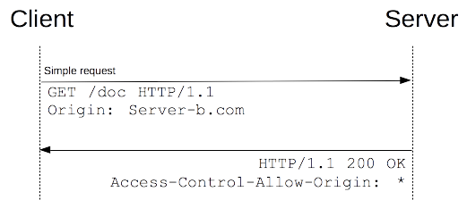

# 简单请求
满足以下条件，会被发起简单请求
+ 请求方式为 HTTP/1.1 GET 或者 POST，如果是POST，则请求的Content-Type为以下之一： application/x-www-form-urlencoded, multipart/form-data, 或text/plain
+ 在请求中，不会发送自定义的头部（如X-Modified）
首先看一张图

这是一段请求体，其实最重要的字段是origin字段，这个字段可以用来做简单的验证是否允许跨域。对于简单请求，浏览器直接发出CORS请求。并在头信息之中，增加一个Origin字段。
```
GET /resources/public-data/ HTTP/1.1
Host: bar.other
User-Agent: Mozilla/5.0 (Macintosh; U; Intel Mac OS X 10.5; en-US; rv:1.9.1b3pre) Gecko/20081130 Minefield/3.1b3pre
Accept: text/html,application/xhtml+xml,application/xml;q=0.9,*/*;q=0.8
Accept-Language: en-us,en;q=0.5
Accept-Encoding: gzip,deflate
Accept-Charset: ISO-8859-1,utf-8;q=0.7,*;q=0.7
Connection: keep-alive
Referer: http://foo.example/examples/access-control/simpleXSInvocation.html
Origin: http://foo.example
```
看一段简单服务器的跨域验证的PHP代码。
```
<?php

// 我们将只授予 arunranga.com 域的访问权限，因为我们认为它通过 application/xml 方式来访问这些资源是安全的。

if($_SERVER['HTTP_ORIGIN'] == "http://arunranga.com")
{
    //这段代码验证origin字段是否为http://arunranga.com，如果是，返回一个Access-Control-Allow-Origin:http://arunranga.com
    header('Access-Control-Allow-Origin: http://arunranga.com');
    header('Content-type: application/xml');
    readfile('arunerDotNetResource.xml');
}
else
{    
header('Content-Type: text/html');
echo "<html>";
echo "<head>";
echo "   <title>Another Resource</title>";
echo "</head>";
echo "<body>",
    "<p>This resource behaves two-fold:";
echo "<ul>",
        "<li>If accessed from <code>http://arunranga.com</code> it returns an XML document</li>";
echo " <li>If accessed from any other origin including from simply typing in the URL into the browser's address bar,";
echo "you get this HTML document</li>", 
    "</ul>",
"</body>",
"</html>";
}
?>
```
1. 如果资源是允许公开访问的(就像任何允许GET访问的 HTTP资源),返回Access-Control-Allow-Origin:*头信息就足够了,除非是一些需要Cookies和HTTP身份验证信息的请求。Access-Control-Allow-Origin字段必须设置，它的值要么是请求时Origin字段的值，要么是一个 * ，表示接受任意域名的请求。如果没有被设置，xhr请求会走到onerror
2. 如果资源访问被限制基于相同的域名,或者如果要访问的资源需要凭证(或设置凭证),那么就有必要对请求头信息中的ORIGIN进行过滤,或者至少响应请求的来源(例如 Access-Control-Allow-Origin:http://arunranga.com)。另外,将发送Access-Control-Allow-Credentials:TRUE头信息。
3. CORS请求时，XMLHttpRequest对象的getResponseHeader()方法只能拿到6个基本字段：Cache-Control、Content-Language、Content-Type、Expires、Last-Modified、Pragma。如果想拿到其他字段，就必须在Access-Control-Expose-Headers里面指定。上面的例子指定，getResponseHeader('FooBar')可以返回FooBar字段的值。

# 预检请求
其余请求，都需要预检。“需预检的请求”要求必须首先使用OPTIONS方法发起一个预检请求到服务器，以获知服务器是否允许该实际请求，服务器对于此options请求的处理与处理常规请求没有区别，
> 注：HTTP 的 OPTIONS 方法 用于获取目的资源所支持的通信选项。
> 例如：curl -X OPTIONS http://example.org -i 可以用来判断服务器支持哪些http请求类型。此处用option来预检本次cors是否被支持。

也来看一张图。

再看一个请求体
```
OPTIONS /resources/post-here/ HTTP/1.1
Host: bar.other
User-Agent: Mozilla/5.0 (Macintosh; U; Intel Mac OS X 10.5; en-US; rv:1.9.1b3pre) Gecko/20081130 Minefield/3.1b3pre
Accept: text/html,application/xhtml+xml,application/xml;q=0.9,*/*;q=0.8
Accept-Language: en-us,en;q=0.5
Accept-Encoding: gzip,deflate
Accept-Charset: ISO-8859-1,utf-8;q=0.7,*;q=0.7
Connection: keep-alive
Origin: http://foo.example
Access-Control-Request-Method: POST
Access-Control-Request-Headers: X-PINGOTHER, Content-Type
```
再看服务器的代码，服务器对于option请求的响应，与处理普通的请求相同。
```
if($_SERVER['REQUEST_METHOD'] == "OPTIONS")
{
    // 告诉客户端我们支持来自 arunranga.com 的请求并且预请求有效期将仅有20天
    if($_SERVER['HTTP_ORIGIN'] == "http://arunranga.com")
    {
    header('Access-Control-Allow-Origin: http://arunranga.com');
    header('Access-Control-Allow-Methods: POST, GET, OPTIONS, DELETE');
    header('Access-Control-Allow-Headers: X-PINGARUNER');
    header('Access-Control-Max-Age: 1728000');
    header("Content-Length: 0");
    header("Content-Type: text/plain");
    //exit(0);
    }
    else
    {
    header("HTTP/1.1 403 Access Forbidden");
    header("Content-Type: text/plain");
    echo "You cannot repeat this request";
   
    }
}
```
浏览器收到响应之后，通过Access-Control-Allow-Methods,Access-Control-Allow-Headers知道你允许POST, GET, OPTIONS, DELETE方法，允许X-PINGARUNER这个自定义头,如果你客户端的请求长成这样，因为设置了不允许的头，请求就会失败。
```
//DELETE请求匹配，使用自定义Header不匹配，不允许跨域
xhr.open('DELETE', 'http://localhost:10000/', true);
xhr.setRequestHeader('x-token1', 'aa');
xhr.send();
```
1. Access-Control-Allow-Methods必须设置，返回服务器支持的所有跨域请求的方法，这是为了避免多次预检请求。
2. 如果浏览器请求包括Access-Control-Request-Headers字段，则Access-Control-Allow-Headers字段是必需的。它也是一个逗号分隔的字符串，表明服务器支持的所有头信息字段。
3. Access-Control-Max-Age用来设置预检请求的有效时间。
4. 必须字段如果不设置，xhr会走到onerror
# 凭证请求
一般而言，对于跨域 XMLHttpRequest 或 Fetch 请求，浏览器不会发送身份凭证信息。如果要发送凭证信息，需要设置 XMLHttpRequest 的某个特殊标志位，withCredentials = true，否则，浏览器请求时不会带上cookie，服务器端也需要设置Access-Control-Allow-Credentials: true，否则，浏览器不会把请求返回给请求者。另外，Access-Control-Allow-Origin不能设置成*，因为cookie必须和某个源绑定，cookie也依然遵循同源规则，客户端不能读取服务端域下的cookie。

# 总结：
1. CORS需要浏览器和服务器同时支持。目前，所有浏览器都支持该功能，IE浏览器不能低于IE10。
2. 整个CORS通信过程，都是浏览器自动完成，不需要用户参与。对于开发者来说，CORS通信与同源的AJAX通信没有差别，代码完全一样。浏览器一旦发现AJAX请求跨源，就会自动添加一些附加的头信息，有时还会多出一次附加的请求，但用户不会有感觉。因此，实现CORS通信的关键是服务器。只要服务器实现了CORS接口，就可以跨源通信。
3. CORS与JSONP的使用目的相同，但是比JSONP更强大。JSONP只支持GET请求，CORS支持所有类型的HTTP请求。JSONP的优势在于支持老式浏览器，以及可以向不支持CORS的网站请求数据。

# 参考文献：
- [HTTP访问控制（CORS）](https://developer.mozilla.org/zh-CN/docs/Web/HTTP/Access_control_CORS)
- [Server-Side Access Control](https://developer.mozilla.org/zh-CN/docs/Web/HTTP/Server-Side_Access_Control)
- [CORS详解.md](https://github.com/hstarorg/HstarDoc/blob/master/%E5%89%8D%E7%AB%AF%E7%9B%B8%E5%85%B3/CORS%E8%AF%A6%E8%A7%A3.md)
- [跨域资源共享 CORS 详解](http://www.ruanyifeng.com/blog/2016/04/cors.html)