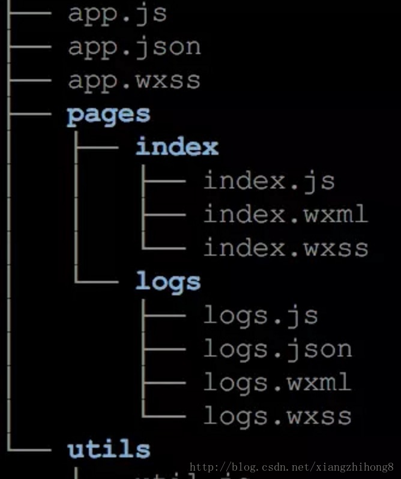
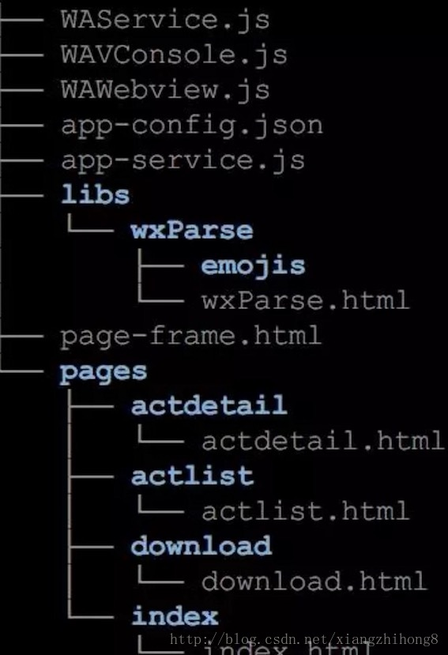
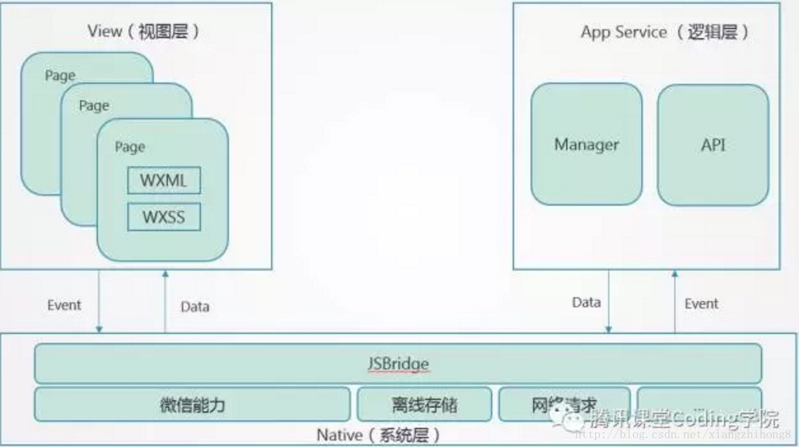

综合几篇文章理一理小程序的原理，也有一些个人的猜想。
首先小程序依旧是一个hybrid解决方案，本质上还是通过webview+jsbridge的方式来做跨平台。
<!-- more -->
# 小程序目录架构

小程序每个页面有四个部分组成 
> 视图：wxml，wxss 逻辑：js，json（页面配置，不是必须）

首先wxml和wxss与html和css应该并无本质差别，一个用来组织页面结构，一个定义页面样式,js部分应该也遵循EcmaScript标准。
wxml部分支持模板，指令等功能。微信小程序会引入一个WAWebview.js文件，这个文件中实现了包括模板，指令，虚拟dom，diff这些东西。这与传统的mvvm框架类似。
# 小程序打包
首先小程序的开发工具是使用nwjs+react实现的(nwjs是一个整合了浏览器与node的运行时环境)，因为有nwsj，所有就可以使用node。所以小程序的打包主要是基于node来做的，打包时会用到babel，因此小程序支持es6，会用到postcss和autoprefixer做css的自动补全，会用ugly.js做代码压缩。小程序被打包后会生成一个.wxapkg文件，这个文件被托管在微信服务器，出于服务器资源的考虑，这个文件不能过大，好像大小上限是1M，这个文件解包后是这样的目录结构：

1. WAService.js 框架JS库，提供逻辑层基础的API能力 
2. WAWebview.js 框架JS库，提供视图层基础的API能力 
3. WAConsole.js 框架JS库，控制台 
4. app-config.js 可以理解成所有页面的.json文件的合集 
5. app-service.js 可以理解成所有页面的.js文件合集
6. page-frame.html 所有的WXML以及公共的wxss样式被拆解为JS实现打包到这里
7. pages 所有页面的wxss文件被打包到单独的文件中放到这里

# 小程序架构与技术实现
微信小程序的框架包含两部分View视图层、App Service逻辑层，View层用来渲染页面结构，AppService层用来逻辑处理、数据请求、接口调用，它们在两个进程（两个Webview）里运行。也就是说，小程序的页面与逻辑是在至少两个webview之间进行的，这两个webview使用jsbridge，具体来说好像是使用window.postmessage来进行通信，这个和传统的mvvm有点不一样。当逻辑层数据变动，会通过jsbridge通知视图层。具体交互如下。

小程序的架构如下：

小程序逻辑处理的JS代码全部加载到一个Webview里面，称之为AppService，整个小程序只有一个，并且整个生命周期常驻内存，而所有的视图（wxml和wxss）都是单独的Webview来承载，称之为AppView。所以一个小程序打开至少就会有2个webview进程，因为每个视图都是一个独立的webview进程，考虑到性能消耗，小程序不允许打开超过5个层级的页面。

## APPservice
AppService即一个简单的页面，主要功能是负责逻辑处理部分的执行，底层提供一个WAService.js的文件来提供各种api接口，主要是以下几个部分： 
1. 日志组件Reporter封装 
2. wx对象下面的api方法 
3. 全局的App,Page,getApp,getCurrentPages等全局方法 
4. 还有就是对AMD模块规范的实现

然后整个页面就是加载一堆JS文件，包括小程序配置config，上面的WAService.js（调试模式下有asdebug.js），剩下就是我们自己写的全部的js文件，一次性都加载。

## AppView
提供UI渲染，底层提供一个WAWebview.js来提供底层的功能,具体如下： 
1. 消息通信封装为WeixinJSBridge（开发环境为window.postMessage, IOS下为WKWebview的window.webkit.messageHandlers.invokeHandler.postMessage，android下用WeixinJSCore.invokeHandler） 
2. 日志组件Reporter封装 
3. wx对象下的api，这里的api跟WAService里的还不太一样，有几个跟那边功能差不多，但是大部分都是处理UI显示相关的方法 
4. 小程序组件实现和注册 
5. VirtualDOM，Diff和Render UI实现 
6. 页面事件触发

# Service和View通信
使用消息publish和subscribe机制实现两个Webview之间的通信，实现方式就是统一封装一个WeixinJSBridge对象，而不同的环境封装的接口不一样。基本上都会提供一个发送消息，监听消息，以及调用原生的接口。

# 参考文献
[三分钟带你了解微信小程序](https://www.jianshu.com/p/4513e679f369)
[微信小程序原理](https://www.jianshu.com/p/fe7a8737680f)
[小程序实现原理解析](https://blog.csdn.net/xiangzhihong8/article/details/66521459)
[微信小程序“反编译”实战（二）：源码还原](https://blog.csdn.net/qq_40126542/article/details/80285820)
[从源码看微信小程序启动过程](https://mp.weixin.qq.com/s/BhENxsKkl7j6PhudP6orCw)
[Technical Differences Between Electron and NW.js (formerly node-webkit)](https://github.com/electron/electron/blob/master/docs/development/atom-shell-vs-node-webkit.md)
[跨平台 App 开发技术方案汇总](https://www.jianshu.com/p/2b4926fa45df)